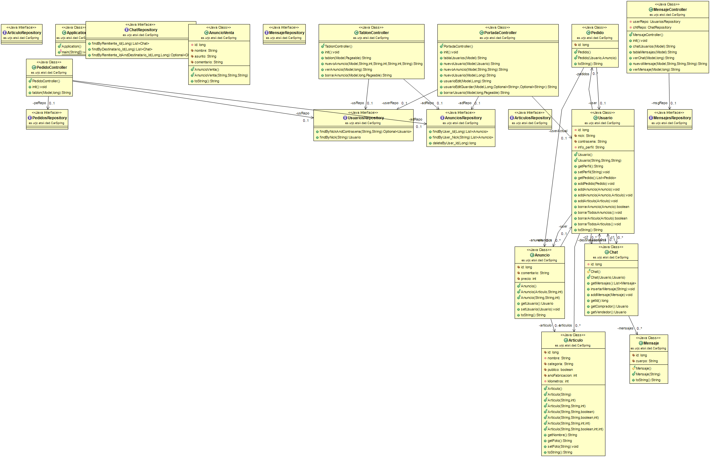

# CarSpring
Plataforma de compra-venta de vehiculos
## Entidades principales
- **Usuario**: Tiene su nombre de usuario y contraseña, puede ver sus datos de contacto, su lista de vehiculos en vehiculos en venta, mensajes enviados y recibidos, listas de vehiculos comprados/vendidos, lista de deseados, y sus valoraciones como usuario.
- **Administrador**: Puede eliminar anuncios o mensajes que vayan contra las normas del sistema. Además de poder eliminar el acceso a usuarios.
- **Anuncio**: Tipo (Venta/Intercambio) Contiene la descripción del vehiculo, usuario vendedor, precio, precio negociable o no.
- **Artículo**: Clasificación (Coche, furgoneta etc), Estado (Nuevo, seminuevo, km0), Marca y Modelo, Descripción, Fotos o Vídeos.
- **Compra**: Asocia un anuncio a su vendedor y su comprador. Se añade a sus respectivas listas de vendidos/comprados y se les deja valorar al vendedor/comprador respectivamente

## Servicio interno
- **Alertas por correo electrónico:** Recibir correo electrónico cuando uno de tus vehiculos ha sido comprado.

## Funcionalidades
### Funcionalidades públicas
- Hacer una búsqueda de un cierto vehiculo utilizando filtros.
- Recorrer una lista de artículos publicados mediante un tablón. 

### Funcionalidades privadas
- Efectuar una compra de un vehiculo.
- Editar un perfil propio con información personal como la ciudad, teléfono de contacto etc
- Ver el perfil de otros usuarios, sus vehiculos en venta y las valoraciones emitidas por otros usuarios.
- Publicar un anuncio de venta.

## Diagrama UML
<kbd></kbd>

## Diagrama Entidad-Relación
<kbd></kbd>

## Diagrama Navegación
<kbd></kbd>

## Capturas de pantalla

**Inicio**
<kbd></kbd>

**Registro**
<kbd></kbd>

**Usuario guardado**
<kbd></kbd>

**Inicio sesión**
<kbd></kbd>

**Tablón de anuncios**
<kbd></kbd>

**Anuncio guardado**
<kbd></kbd>

**Anuncio**
<kbd></kbd>

**Perfil de usuario**
<kbd></kbd>

**Editar usuario**
<kbd></kbd>

# Equipo de desarrollo
| **Nombre**  | **Correo**  | **Github**  | 
|---|---|---|
| José Moreno Ruiz  | j.morenoru.2018@alumnos.urjc.es   | https://github.com/Jomr02  |  
|  Sergio Martín Vaquero |  s.martinvaq@alumnos.urjc.es | https://github.com/srgmrtnvqr |
