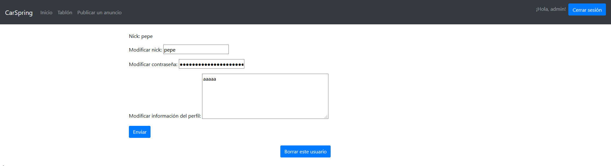

# CarSpring
Plataforma de compra-venta de vehiculos
## Entidades principales
- **Usuario**: Tiene su nombre de usuario y contraseña, puede ver sus datos de contacto, su lista de vehiculos en vehiculos en venta, mensajes enviados y recibidos, listas de vehiculos comprados/vendidos, lista de deseados, y sus valoraciones como usuario.
- **Administrador**: Puede eliminar anuncios o mensajes que vayan contra las normas del sistema. Además de poder eliminar el acceso a usuarios.
- **Anuncio**: Tipo (Venta/Intercambio) Contiene la descripción del vehiculo, usuario vendedor, precio, precio negociable o no.
- **Artículo**: Clasificación (Coche, furgoneta etc), Estado (Nuevo, seminuevo, km0), Marca y Modelo, Descripción, Fotos o Vídeos.
- **Compra**: Asocia un anuncio a su vendedor y su comprador. Se añade a sus respectivas listas de vendidos/comprados y se les deja valorar al vendedor/comprador respectivamente

## Servicio interno
- **Alertas por correo electrónico:** Recibir correo electrónico cuando uno de tus vehiculos ha sido comprado.

## Funcionalidades
### Funcionalidades públicas
- Hacer una búsqueda de un cierto vehiculo utilizando filtros.
- Recorrer una lista de artículos publicados mediante un tablón. 

### Funcionalidades privadas
- Efectuar una compra de un vehiculo.
- Editar un perfil propio con información personal como la ciudad, teléfono de contacto etc
- Ver el perfil de otros usuarios, sus vehiculos en venta y las valoraciones emitidas por otros usuarios.
- Publicar un anuncio de venta.

## Video CarSpring
[](https://www.youtube.com/watch?v=0stK0qlXcdw "CarSpring")

## Diagrama Dockers
<kbd></kbd>

## Diagrama UML
<kbd></kbd>

## Diagrama Entidad-Relación
<kbd></kbd>

## Diagrama Navegación
<kbd></kbd>

## Diagrama UML Servicio Interno
<kbd></kbd>

# Despliegue de la máquina virtual<a name="despliegueVM"></a>
Hemos creado la máquina virtual de tipo ubuntu/trusty32, utilizando Vagrant. Es necesario configurar la máquina virtual para que se pueda acceder a ella desde el host, a través de la red, por el puerto 8443 en la dirección 192.168.33.10.
```
cd /vagrant
vagrant up
vagrant ssh
```

### Instalación del JRE de Java 8 en la VM
```
sudo add-apt-repository ppa:openjdk-r/ppa
sudo apt-get update
sudo apt-get install openjdk-8-jre
```

### Instalación de MySQL en la VM
Nuestro usuario es "root" con contraseña "1234"
```
sudo apt-get install mysql-server
mysql -u root -p
	mysql> CREATE DATABASE miservidor;
exit
```  
  

### Compilación de la aplicación
Para que se compile y genere el .jar correctamente, es necesario especificar en el pom.xml que queremos que se haga 'repackage' en la build. Después, ejecutamos como Maven Build y escribimos "clean package" en el cuadro 'goals'.
```
<build>
	<plugins>
		<plugin>
			<groupId>org.springframework.boot</groupId>
			<artifactId>spring-boot-maven-plugin</artifactId>
	    	<version>2.2.6.RELEASE</version>
		    <executions>
       			<execution>
    				<goals>
        				<goal>repackage</goal>
       				</goals>
       			</execution>
   			</executions>			
   		</plugin>
	</plugins>
</build>
```
### Ejecución
Es necesario guardar los ficheros .jar de la web y del servicio a la carpeta compartida entre el host y la máquina virtual.

Para poder ejecutar los dos .jar es necesario abrir dos terminales e iniciar la máquina virtual en ambos. Después ejecutaremos un .jar en cada uno.
```
vagrant up
vagrant ssh
cd /vagrant
java -jar ./DAD_CarSpring-0.0.1-SNAPSHOT.jar
```
```
vagrant up
vagrant ssh
cd /vagrant
java -jar ./ServicioInternoCarSpring-0.0.1-SNAPSHOT.jar
```
__________________________

## Capturas de pantalla Fase 3


**Inicio**
<kbd></kbd>

**Registrar usuario**
<kbd></kbd>

**Usuario guardado**
<kbd></kbd>

**Iniciar sesión**
<kbd></kbd>

**Tablón de anuncios**
<kbd></kbd>
  
**Publicar anuncio**
<kbd></kbd>
  
**Publicar anuncio**
<kbd></kbd>

**Ver anuncio individual**
<kbd></kbd>
  
**Ver anuncio como Admin**
<kbd></kbd>

**Perfil usuario**
<kbd></kbd>

**Perfil usuario como Admin**
<kbd></kbd>

**Editar usuario (solo Admin)**
<kbd></kbd>

**Borrar usuario (solo Admin)**
<kbd></kbd>
  
**Enviar un mensaje a usuario**
<kbd></kbd>
  
**Bandeja de mensajes**
<kbd></kbd>

## Capturas de pantalla Fase 2


**Inicio**
<kbd></kbd>

**Registro**
<kbd></kbd>

**Usuario guardado**
<kbd></kbd>

**Inicio sesión**
<kbd></kbd>

**Tablón de anuncios**
<kbd></kbd>

**Anuncio guardado**
<kbd></kbd>

**Anuncio**
<kbd></kbd>

**Perfil de usuario**
<kbd></kbd>

**Editar usuario**
<kbd></kbd>


# Equipo de desarrollo
| **Nombre**  | **Correo**  | **Github**  | 
|---|---|---|
| José Moreno Ruiz  | j.morenoru.2018@alumnos.urjc.es   | https://github.com/Jomr02  |  
|  Sergio Martín Vaquero |  s.martinvaq@alumnos.urjc.es | https://github.com/srgmrtnvqr |
